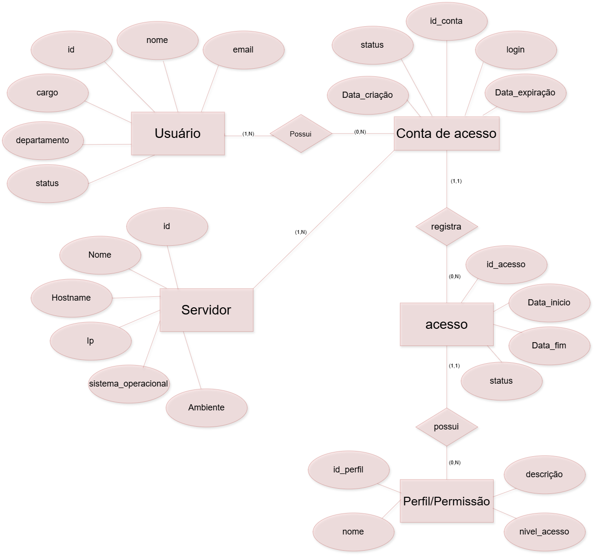
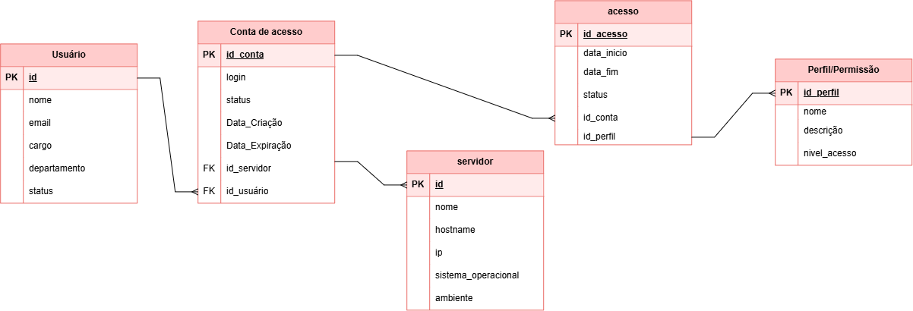

# sesi_bcd_vps01_Provisionamento-de-acessos-a-servidores_2026
# Projeto: Provisionamento de Acessos a Servidores

Sistema para gestão e provisionamento de acessos de usuários a servidores, controlando contas, perfis, permissões, períodos e situações de acesso.

## Modelagem MER / DER

### MER / DER Conceitual



### MER / DER Lógico



## Dicionário de Dados

| Entidade | Atributo | Tipo | Tamanho | Descrição |
| -------- | -------- | ---- | ------- | --------- |
| usuario | id | Inteiro | 11 | Identificador, PK, Auto incrementável |
| usuario | nome | Texto | 100 | Nome do usuário |
| usuario | email | Texto | 100 | E-mail do usuário (Único) |
| usuario | cargo | Texto | 50 | Cargo do usuário |
| usuario | departamento | Texto | 50 | Departamento do usuário |
| usuario | status | Texto | 20 | Status do usuário ('Ativo' ou 'Inativo') |
| servidor | id | Inteiro | 11 | Identificador, PK, Auto incrementável |
| servidor | nome | Texto | 50 | Nome do servidor |
| servidor | hostname | Texto | 100 | Hostname de rede (Único) |
| servidor | ip | Texto | 45 | Endereço IP do servidor (Único) |
| servidor | sistema_operacional | Texto | 50 | Sistema operacional do servidor |
| servidor | ambiente | Texto | 20 | Ambiente ('Desenvolvimento', 'Testes', 'Produção') |
| conta_acesso | id | Inteiro | 11 | Identificador, PK, Auto incrementável |
| conta_acesso | id_usuario | Inteiro | 11 | FK referenciando usuario (id) |
| conta_acesso | id_servidor | Inteiro | 11 | FK referenciando servidor (id) |
| conta_acesso | login | Texto | 50 | Login da conta no servidor |
| conta_acesso | status | Texto | 20 | Status da conta ('Ativa', 'Bloqueada', 'Cancelada') |
| conta_acesso | data_criacao | Data/Hora | - | Data e hora de criação da conta |
| conta_acesso | data_expiracao | Data/Hora | - | Data e hora de expiração da conta |
| perfil_permissao | id | Inteiro | 11 | Identificador, PK, Auto incrementável |
| perfil_permissao | nome | Texto | 50 | Nome do perfil de permissão |
| perfil_permissao | descricao | Texto | 255 | Descrição do perfil de permissão |
| perfil_permissao | nivel_acesso | Inteiro | 11 | Nível numérico de acesso |
| acesso | id | Inteiro | 11 | Identificador, PK, Auto incrementável |
| acesso | id_conta | Inteiro | 11 | FK referenciando conta_acesso (id) |
| acesso | id_perfil | Inteiro | 11 | FK referenciando perfil_permissao (id) |
| acesso | data_inicio | Data/Hora | - | Data e hora de início do acesso |
| acesso | data_fim | Data/Hora | - | Data e hora de término do acesso |
| acesso | status | Texto | 20 | Status do acesso ('Ativo', 'Revogado', 'Expirado') |

## Dados de teste em CSV

Os dados de teste foram separados em arquivos CSV:

- [usuario.csv](usuario.csv)
- [servidor.csv](servidor.csv)
- [conta_acesso.csv](conta_acesso.csv)
- [perfil_permissao.csv](perfil_permissao.csv)
- [acesso.csv](acesso.csv)

## Script SQL DDL

```sql
drop database if exists provisionamento_acessos;
create database provisionamento_acessos;
use provisionamento_acessos;

create table usuario(
    id int not null primary key auto_increment,
    nome varchar(100) not null,
    email varchar(100) not null unique,
    cargo varchar(50) not null,
    departamento varchar(50) not null,
    status enum('Ativo', 'Inativo') not null default 'Ativo'
);

create table servidor(
    id int not null primary key auto_increment,
    nome varchar(50) not null,
    hostname varchar(100) not null unique,
    ip varchar(45) not null unique,
    sistema_operacional varchar(50) not null,
    ambiente enum('Desenvolvimento', 'Testes', 'Produção') not null
);

create table conta_acesso(
    id int not null primary key auto_increment,
    id_usuario int not null,
    id_servidor int not null,
    login varchar(50) not null,
    status enum('Ativa', 'Bloqueada', 'Cancelada') not null default 'Ativa',
    data_criacao datetime not null,
    data_expiracao datetime
);

create table perfil_permissao(
    id int not null primary key auto_increment,
    nome varchar(50) not null,
    descricao varchar(255),
    nivel_acesso int not null
);

create table acesso(
    id int not null primary key auto_increment,
    id_conta int not null,
    id_perfil int not null,
    data_inicio datetime not null,
    data_fim datetime,
    status enum('Ativo', 'Revogado', 'Expirado') not null default 'Ativo'
);

alter table conta_acesso add constraint fk_conta_usuario foreign key (id_usuario) references usuario(id);
alter table conta_acesso add constraint fk_conta_servidor foreign key (id_servidor) references servidor(id);

alter table acesso add constraint fk_acesso_conta foreign key (id_conta) references conta_acesso(id);
alter table acesso add constraint fk_acesso_perfil foreign key (id_perfil) references perfil_permissao(id);

describe usuario;
describe servidor;
describe conta_acesso;
describe perfil_permissao;
describe acesso;
show tables;
```
## Script SQL DML

```dml
use provisionamento_acessos;

insert into usuario(nome, email, cargo, departamento, status) values
("Percy Jackson", "percy.jackson@gmail.com", "Líder de Operações", "Sistemas", "Ativo"),
("Annabeth Chase", "annabeth.chase@gmail.com", "Arquiteta de Software", "Engenharia", "Ativo"),
("Grover Underwood", "grover.underwood@gmail.com", "Analista de Segurança", "TI", "Ativo"),
("Nico di Angelo", "nico.diangelo@gmail.com", "Administrador de Banco de Dados", "TI", "Ativo");

insert into servidor(nome, hostname, ip, sistema_operacional, ambiente) values
("SRV-Olimpo-DB", "db-olimpo.local", "192.168.1.10", "Ubuntu 22.04 LTS", "Desenvolvimento"),
("SRV-Quiron-TST", "quiron-test.local", "192.168.1.20", "Debian 11", "Testes"),
("SRV-Acampamento-PROD", "prod-01.local", "10.0.0.50", "Red Hat Enterprise Linux 9", "Produção");

insert into conta_acesso(id_usuario, id_servidor, login, status, data_criacao, data_expiracao) values
(1, 1, "pjackson_dev", "Ativa", "2026-01-10 09:00:00", "2026-12-31 23:59:59"),
(2, 3, "achase_admin", "Ativa", "2026-01-15 10:30:00", null),
(3, 2, "gunderwood_sec", "Ativa", "2026-02-01 14:00:00", null),
(4, 1, "ndiangelo_db", "Ativa", "2026-02-10 11:20:00", null);

insert into perfil_permissao(nome, descricao, nivel_acesso) values
("Administrador (Root)", "Acesso total e irrestrito ao sistema", 1),
("Desenvolvedor", "Acesso para Deploy e Leitura de Logs", 3),
("Segurança e Auditoria", "Acesso de monitoramento e análise de vulnerabilidades", 2);

insert into acesso(id_conta, id_perfil, data_inicio, data_fim, status) values
(1, 2, "2026-01-10 09:05:00", "2026-12-31 23:59:59", "Ativo"),
(2, 1, "2026-01-15 10:35:00", null, "Ativo"),
(3, 3, "2026-02-01 14:05:00", null, "Ativo"),
(4, 1, "2026-02-10 11:25:00", null, "Ativo");

select * from usuario;
select * from servidor;
select * from conta_acesso;
select * from perfil_permissao;
select * from acesso;
